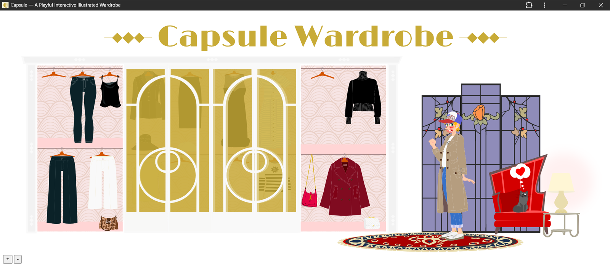

# Capsule

Capsule is an interactive illustrated capsule wardrobe experience built as a Progressive Web App.

The project is centered around a complex inline SVG illustration representing a wardrobe and a model.  
Users can combine clothing items by interacting directly with the illustration and receive playful visual feedback.

Capsule is not a traditional game: there is no score, no winning or losing.  
The interaction itself — exploring combinations and visual outcomes — is the experience.

## Features

- Inline SVG illustration with high visual detail
- JavaScript-driven interactions
- Progressive Web App (PWA)
- Offline-capable logic via Service Worker
- Designed primarily for landscape orientation

## Technology

- HTML
- CSS
- JavaScript
- Inline SVG
- Progressive Web App APIs (Manifest, Service Worker)

No backend, no database.

## Live Demo

https://svgartwork.github.io/capsule/

## Notes

Capsule is conceived as a visual-first, exploratory experience.  
It works best on larger screens or in landscape orientation.

---

© Gianluca Santoni
